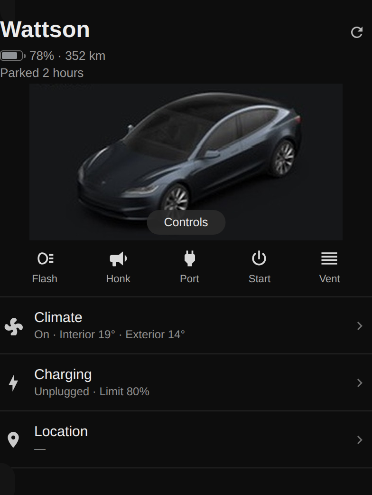
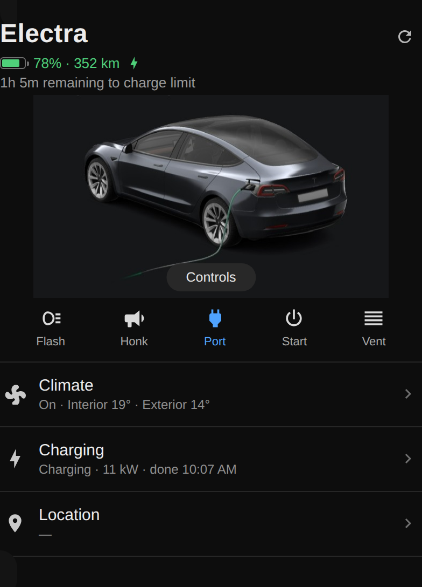
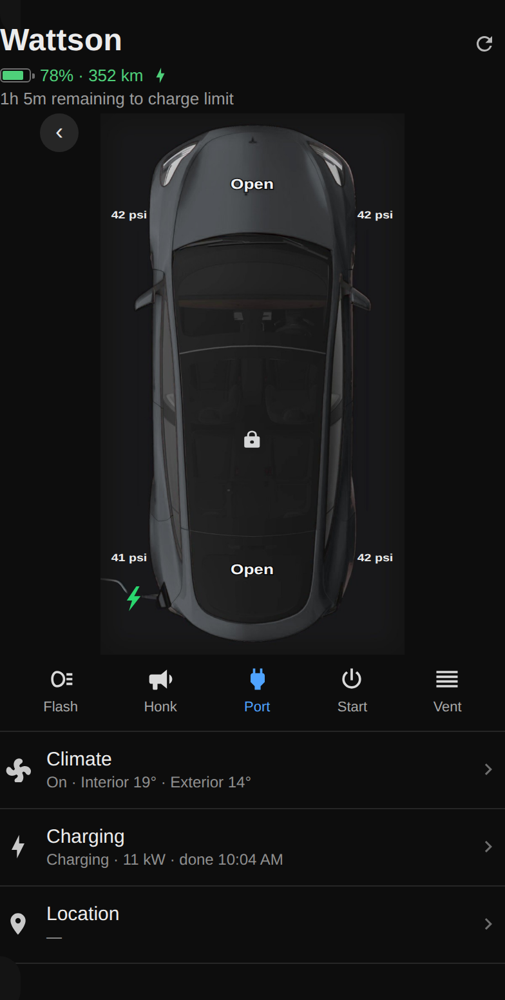
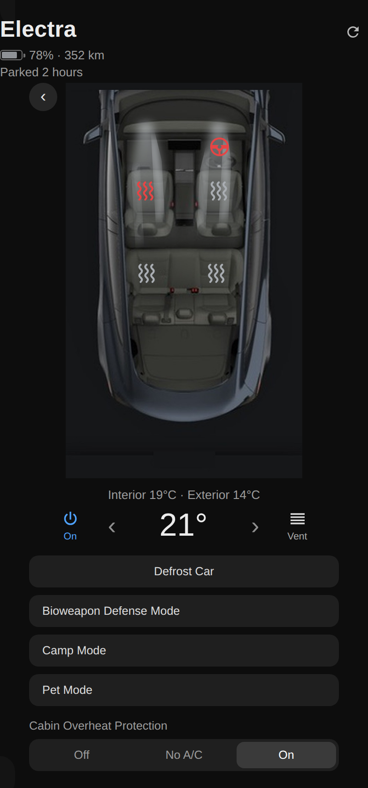

# Tesla Fleet Card

**A Tesla-app-style card for your Home Assistant dashboard.** One card shows your
whole fleet - battery, range, charging, climate, locks, location - looking and
behaving like the official Tesla app, and switching between cars in one click.

Works with **both** Tesla integrations, automatically:
[tesla_custom](https://github.com/alandtse/tesla) (HACS) **and** the official
**tesla_fleet** integration.

> ⚡ **Fully vibecoded.** Not a single line of this was typed by a human.
> It was built conversationally with Claude (Anthropic), iterating against
> screenshots and screen recordings of the real Tesla app until the two were
> hard to tell apart. Bugs are the AI's fault; the good ideas were Nick's. 🙂

| Home | Charging | Controls | Climate |
| --- | --- | --- | --- |
|  |  |  |  |

---

## Install

**Via HACS (recommended):**

1. HACS → three-dots menu (top right) → **Custom repositories**.
2. Paste this repository's URL, choose category **Dashboard**, click **Add**.
3. Find **Tesla Fleet Card** in HACS and click **Download**.
4. Hard-refresh your browser (Ctrl+F5 / Cmd+Shift+R). HACS registers the
   dashboard resource automatically; if the card still says
   "Custom element doesn't exist", check Settings → Dashboards → three-dots →
   **Resources** for `/hacsfiles/tesla-fleet-homeassistant/tesla-fleet-card.js`
   (type *module*) and add it if missing.

**Manual install:** copy `tesla-fleet-card.js` to `/config/www/`, add a
dashboard resource `/local/tesla-fleet-card.js` (type *module*), and bump a
`?v=` query string on that URL every time you update the file.

## Quick start

1. Edit your dashboard → **Add card** → search **Tesla Fleet Card**.
2. Fill in the four fields:
   - **Name** - whatever you call the car.
   - **Model** - Model 3 or Model Y (picks the built-in artwork).
   - **Paint** - red, grey, … (picks the image pack and artwork colour).
   - **Entity prefix** - how your car's entities are named. Look at your
     battery entity: `sensor.battery` → leave empty; `sensor.saoirse_battery`
     → enter `saoirse_`. Works for both integrations; the card detects which
     one you're on.
3. Save. Add more cars with **+ Add car** - a dropdown on the car's name
   switches between them.

The same config in YAML:

```yaml
type: custom:tesla-fleet-card
cars:
  - name: Patsy
    model: Model Y
    paint: red
    prefix: ""
```

## What you get

- **Home view** - your car resting, like the app's opening screen. Plugging in
  swaps to the cable shot; charging animates a green pulse along the cable
  (timing measured from the real app, frame by frame). Tap the car for
  Controls.
- **Controls view** - top-down car with tappable frunk/boot **Open** labels
  (two-tap confirm), lock/unlock on the roof, tyre pressures at the corners
  (psi or bar, whatever your integration reports), and a breathing charge bolt
  while charging.
- **Climate view** - the interior. Tap any seat to cycle its heater (uses
  whichever heat levels your car offers - ventilated-seat cars included),
  tap the steering wheel for its heater, set the temperature, Vent,
  **Defrost Car** - plus Bioweapon Defence, Camp and Pet modes and Cabin
  Overheat Protection where your car supports them.
- **Charging panel** - charge-limit slider with a click-stop at 80 %, live
  `kW · +kWh · A/maxA · V` stats, "1h 5m remaining to charge limit" in the
  header, amps stepper, Stop Charging / Unlock Charge Port as applicable.
- **Action row** - Flash, Honk, Port, Start, Vent (destructive ones need a
  second tap).
- **No images needed** - everything above works out of the box with built-in
  drawn artwork in your paint colour. Real photos make it beautiful; see below.

## Images

The card looks for images in this order - first hit wins:

1. **Per-car options in YAML** - `image`, `image_side`, `image_charging`,
   `image_climate` and friends, each a `/local/...` path or full URL.
2. **A per-car pack folder** - `images: /local/my-pack` (or any URL base,
   e.g. a CDN or GitHub raw path).
3. **The shared pack folder** - `/config/www/tesla-fleet-card/images/` using
   the layout `models/<3|y>/<paint>/app/`. Drop packs here once; the card
   finds them from each car's Model + Paint with zero config, and HACS
   updates never touch this folder.
4. **The packs published in this repository** - fetched automatically over
   GitHub raw for your car's Model + Paint. Zero config, and pack updates
   arrive on their own without a card update.
5. Nothing found → built-in drawn artwork.

Pack photos are treated as complete: the card draws no cable overlay on
them - a charging photo's own cable shows the state.

A pack is seven JPEGs with these names and sizes:

| File | Size (px) | What it shows |
| --- | --- | --- |
| `topdown.jpg` | 720 × 1284 | Top-down car, nose at top, ~2 % margin, background `#141414`. |
| `topdown-plugged.jpg` | 720 × 1284 | Same, charge cable attached. |
| `topdown-charging.jpg` | 720 × 1284 | Same, charging. |
| `side.jpg` | 660 × 330 | Resting ¾ view, centred. |
| `side-plugged.jpg` | 660 × 330 | Same, cable attached. |
| `side-charging.jpg` | 660 × 375 | Same, charging, cable in shot. |
| `climate.jpg` | 720 × 1200 | Interior top-down: dash ~10 % down, front seats ~27 %, rear bench ~48 %. |

Make your own from your own Tesla app: screenshot the app's home screen
(parked, plugged, charging), Controls and Climate pages full-screen on the
biggest display you have, crop to the car, patch out the baked-in UI labels
(the card draws live ones), save to the sizes above on `#141414`.

**Controls not lining up on your images?** Set `calibrate: true` on the car,
tap the image where each control sits, read the coordinates off the badge, and
put them in `climate_anchors:` / `top_anchors:` (then remove `calibrate`).
Images made to the spec table need none of this.

## All YAML options

Per car:

| Option | What it does |
| --- | --- |
| `name`, `model`, `paint` | As in the editor. `paint` picks the image-pack folder, and colours the car's dot in the switcher. |
| `prefix` | Entity prefix. |
| `integration` | `auto` (default) / `tesla_custom` / `tesla_fleet`. |
| `entities:` | Per-entity overrides, e.g. `energy_added: sensor.modely_energy_added`. |
| `images` | Pack base folder or URL for this car. |
| `image`, `image_top_plugged`, `image_top_charging` | Top-down photos. |
| `image_side`, `image_side_plugged`, `image_charging` | Resting-view photos. |
| `image_climate` | Interior photo. |
| `cable: baked` | Photos already contain the cable (automatic when a pack is in use). |
| `cable_path`, `port_xy`, `port_top_xy` | Charging-animation anchors. |
| `climate_anchors:`, `top_anchors:`, `calibrate` | Tap-target positions for your own images. |
| `hide_seats` | Seats your car physically lacks, e.g. `hide_seats: [rl, rr]`. Keys: `fl fr rl rr`. Unavailable seat entities hide automatically. |
| `hide_climate` | Climate features your car lacks, e.g. `hide_climate: [bio]`. Keys: `bio camp pet`. |
| `show_climate` | Climate features your car has that the card assumed it did not, e.g. `show_climate: [bio]` for a Model 3 with a retrofitted HEPA filter. |

Card level: `default_car`, `show_tpms`, `tpms_min` (psi; auto-converted for
bar), `accent`, `drive_speed`, `show_vin`.

| Card option | What it does |
| --- | --- |
| `drive_speed` | Scales the driving animation. 1 is the default; 1.5 makes the road and wheels half again as fast. The animation is proportional to the car's actual speed, so this only changes the overall pace. |
| `show_vin` | Prints the VIN in the footer beside the year and model. Off by default: it identifies a specific vehicle and dashboards get screenshotted, so it sits in the footer's tooltip instead unless you ask for it. |

The footer shows the model year, which is decoded from the tenth character of
the VIN. The card reads the VIN from the car's own entity attributes, so there
is nothing to configure.

### Bioweapon Defense Mode

Tesla Custom reports the same `fan_modes` list for every car, so it cannot be
used to tell a car that has Bioweapon Defense Mode from one that does not. The
card falls back to the model instead: the mode needs a HEPA filter, which Model
S, X and Y carry and Model 3 does not, so the button is hidden on a Model 3.

The year matters too, and the card cannot see it. Model Y was built without the
filter until Tesla added it to the production line in June 2021, and Model S and
X only got it from 2016. Both are retrofittable. So:

- a 2020 or early-2021 Model Y wants `hide_climate: [bio]`
- a pre-2016 Model S or X wants `hide_climate: [bio]`
- any car with a retrofitted filter wants `show_climate: [bio]`

Nothing in the integration exposes a build year or a VIN today, which is why
this is config rather than detection.

## Updating

HACS shows updates as versioned releases. After updating, hard-refresh the
browser. The running version prints in the browser console when the card
loads.

## Requirements

Home Assistant with the [tesla_custom](https://github.com/alandtse/tesla)
HACS integration or the official tesla_fleet integration - and a Tesla. 🚗

## Credits

Designed by mimicking the official Tesla app. Built end-to-end by
[Claude](https://claude.ai) in conversation with MrNickIE, who supplied
the screenshots, the screen recordings, the opinions, and the phrase
"you have drawn a SPACESHIP". Shared under the MIT licence - enjoy.

## Seat, wheel and climate display

Tesla stores a **mode and a level**, not a single number: Auto, or Heat or
Cool at Low, Medium or High. Setting a level by hand moves the car out of
Auto, which is what the app's Heat / Auto control is doing.

The card follows that:

- **Off** - grey waves
- **Heat** - one, two or three red waves
- **Cool** - the same in blue, on cars with ventilated seats
- **Auto** - waves plus the word `Auto`, the way the app labels it, so Auto
  is never mistaken for maximum heat

The steering wheel gets the same treatment with two steps rather than three,
matching the car. On models that expose only a plain on/off switch the card
falls back to that automatically.

## Running the tests

The card is one dependency-free file, so the only tooling here is the test
suite. It drives the real card in a real browser, because the bugs worth
catching in a custom card are the ones that only appear with genuine DOM
behaviour.

```
npm install
npm test
```

22 checks covering entity detection on both integrations, the per-car entity
overrides, and the editor. It exits non-zero on failure.

It is worth knowing why it exists. In v1.1.0 a reported bug ("the editor keeps
reverting to the first vehicle") was diagnosed by reading the code, declared
fixed, and shipped still broken, because the real fault was a shadow-root
teardown that only shows up when a browser is actually running. Run against
v1.1.1 this suite fails on exactly the five things v1.1.2 fixed. If you are
changing detection or the editor, run it.

## Contributing an image pack

A pack is seven photos from the Tesla app, in `images/models/<3|y>/<paint>/app/`:

`topdown.jpg` · `topdown-plugged.jpg` · `topdown-charging.jpg` · `side.jpg` · `side-plugged.jpg` · `side-charging.jpg` · `climate.jpg`

Partial packs are fine - the card probes each slot and uses what it finds.

**If you add a pack, add it to `PACKS_SHIPPED` in `tesla-fleet-card.js` too.** That
list is what the card shows a user whose model and paint have no artwork yet, so
it going stale is worse than useless: it either hides a pack that exists, or sends
someone to one that doesn't.
